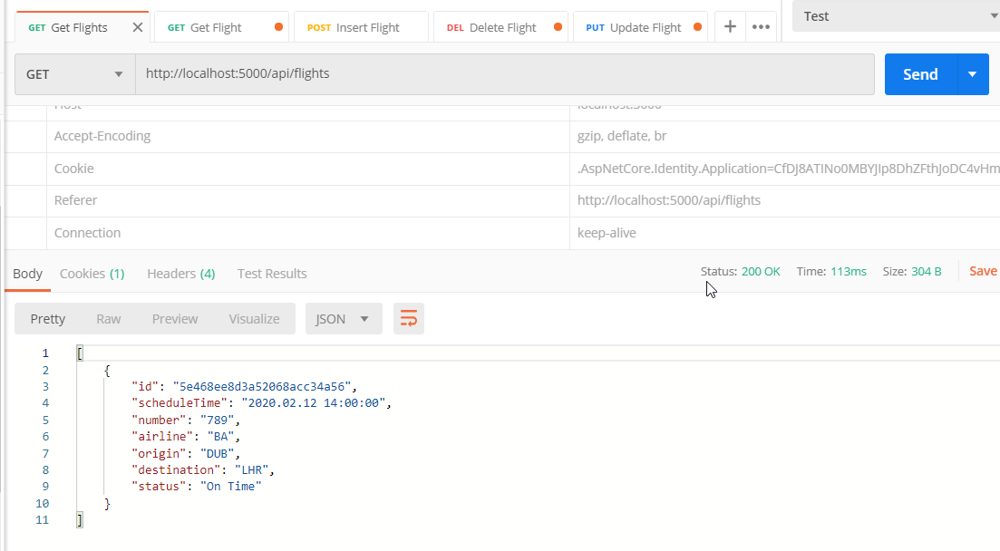

A very basic REST web API, written in both Java 8 and .Net Core, to demonstrate the basic usage of MongoDB.

Currently a work in progress.. will finish if shown enough interest..

Overview:
A RESTful Flight Api which stores basic information about a Flight.
All CRUD operations supported, plus some basic adhoc filtering
Both APIs offer identical functionality and run on port 5000 (so you can not run both at once)
Both have an in-memory (non MongoDB) implementation as I had intended implementing the Mongo Repository during the presentation but changed my mind..

Usage:
1. Start MongoDB
   Recommend using Docker: "docker run -d mongo:latest"
2. Start the app
   - Java: Open the pom file in Intellij and hit run
   - .NetCore: Open in Visual Studio 2019 and hit run (ensure web project is the startup project)
3. Open Postman, import collection from Postman directory and interact using the REST enpoints provided!

